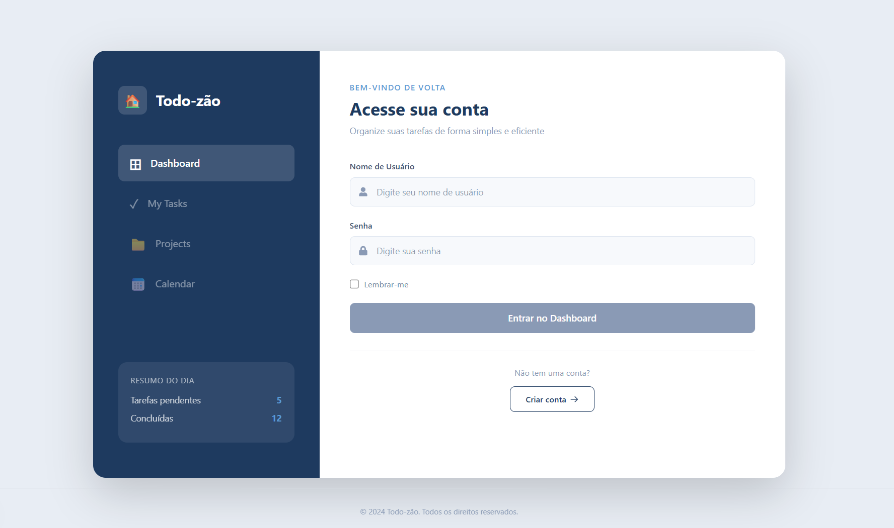

## 📚 Documentação do projeto

## Equipe
- Augusto Jorge Brandão Mendonça
- João Vitor da Silva Moura
- Nathan Edhuardo Cavalcanti dos Santos
- Tayson Joel

### 📌 Visão Geral
Projeto full stack para gerenciamento de tarefas, com backend em Java/Spring Boot e frontend em Next.js. O backend contém camadas **Controller → Service → Repository**, DTOs para entrada/saída, autenticação com JWT e tratamento centralizado de exceções. O frontend já possui fluxo de autenticação e a área de perfil pronta para servir de base às próximas telas do time.

### 🖥 Interface do sistema

<p align="center">
  
</p>

### 🛠 O que foi implementado
- Registro de histórico de alteração de status das Tasks (`TaskHistory`). ✅
- Endpoints, serviços e repositórios para **RecurrenceRule**, **Subtask** e **Notification**.
- Repositórios adicionados: `NotificationRepository`, `RecurrenceRuleRepository`, `SubtaskRepository`.
- Implementação customizada do repositório de Tasks (interface `TaskRepositoryCustom` e `TaskRepositoryImpl` usando `EntityManager`).
- DTOs de criação e resposta para recursos (CreateDTO / ResponseDTO).
- Exceções personalizadas (`ApplicationException`, `ResourceNotFoundException`, `BadRequestException`, etc.) e `GlobalExceptionHandler`.
- Testes unitários e de integração cobrindo controllers, services e repositórios.
- Ajustes para estabilidade dos testes (ex.: **Task** com status padrão `PENDING`).
- Exportação de classes criadas em `classesCriadas/` para revisão.

### ⚙️ Como funciona (fluxos principais)
- Alteração de status: ao mudar o status de uma Task é criado um registro em `TaskHistory` dentro de uma transação para garantir consistência.
- Recorrências: `RecurrenceRule` pode ser associada a uma `Task` para representar regras de repetição.
- Subtarefas: `Subtask` pertence a uma `Task` e oferece marcação de conclusão.
- Notificações: `Notification` está vinculada a uma `Task` e é criada via endpoint dedicado.
- Erros são mapeados para respostas HTTP apropriadas pelo `GlobalExceptionHandler`.

### 🚀 Como rodar o projeto (localmente)
- Backend:
  - Requisitos: **Java 21** e Maven, ou o wrapper `./mvnw` / `.\mvnw.cmd`
  - Rodar testes: `./mvnw test` (Windows: `.\mvnw.cmd test`)
  - Rodar aplicação: `./mvnw spring-boot:run` (Windows: `.\mvnw.cmd spring-boot:run`)
  - Rodar backend local com H2: `./mvnw spring-boot:run -Dspring-boot.run.profiles=dev` (Windows: `.\mvnw.cmd spring-boot:run "-Dspring-boot.run.profiles=dev"`)
  - Em desenvolvimento local, configure `DATABASE_URL`, `DATABASE_USERNAME`, `DATABASE_PASSWORD` e opcionalmente `JWT_SECRET`
- Frontend:
  - Requisitos: **Node.js 20+**
  - Em `front-todo`, instale dependências com `npm install`
  - Crie `.env.local` a partir de `.env.example`
  - Rode `npm run dev`
  - Frontend padrão: `http://localhost:3000`
  - Backend padrão consumido pelo frontend: `http://localhost:8080`

### 📦 Tecnologias e dependências principais
- Linguagem: Java 21
- Framework: Spring Boot 3.x
- Persistência: Spring Data JPA, Hibernate
- Banco (testes): H2 (in-memory)
- Testes: JUnit 5, Spring Boot Test, MockMvc
- Validação: Jakarta Bean Validation
- Build: Maven

### 🔁 Testes
- Existem testes unitários e de integração em `src/test/java`.
- Executar todos: `./mvnw test` (ou `.\mvnw.cmd test`).
- Os testes de integração usam o perfil `test` com H2 em memória.

### 👤 Perfil do usuário

- Login retorna JWT em `POST /auth/login`
- O frontend autenticado consome `GET /users/me/profile`
- Atualização do perfil usa `PUT /users/me/profile`
- Campos persistidos do perfil:
  - `name`
  - `email`
  - `headline`
  - `bio`
  - `location`

Essa estrutura já está pronta e pode ser usada pelo restante do time como referência visual e técnica para as demais telas autenticadas.

### 🔗 Endpoints principais e exemplos de payloads

#### Tasks
- POST `/api/tasks`
  - Request (TaskDTO):
  ```json
  {
    "title": "Estudar POO",
    "description": "Ler capítulos 1 e 2",
    "color": "#ff0000",
    "priority": "HIGH",
    "dueDate": "2025-12-31",
    "type": "TASK",
    "resetRule": null,
    "userId": 1,
    "projectId": 1
  }
  ```
  - Response: `201 Created` com `TaskDTO` (contendo `id` e demais campos).

- GET `/api/tasks`
  - Response: `200 OK` com lista de `TaskDTO`.

- GET `/api/tasks/{id}`
  - Response: `200 OK` com `TaskDTO`.

- GET `/api/tasks/user/{userId}` — lista de tarefas do usuário.
- GET `/api/tasks/project/{projectId}` — lista de tarefas do projeto.

- PUT `/api/tasks/{id}`
  - Request: `TaskDTO` (mesmos campos de criação).
  - Response: `200 OK` com `TaskDTO` atualizado.

- PUT `/api/tasks/{id}/status/{status}`
  - `status` deve ser um valor do `enum TaskStatus`: `PENDING`, `IN_PROGRESS`, `COMPLETED`, `CANCELLED`, `OVERDUE`.
  - Response: `200 OK` com `TaskDTO` atualizado; alteração gera registro em `TaskHistory`.

- DELETE `/api/tasks/{id}` — `204 No Content`.

#### Subtasks
- POST `/api/subtasks`
  - Request (SubtaskCreateDTO):
  ```json
  {
    "title": "Pesquisar exemplos",
    "taskId": 5
  }
  ```
  - Response: `201 Created` com `SubtaskResponseDTO`.

- GET `/api/subtasks/{id}` — `200 OK`.
- GET `/api/subtasks/task/{taskId}` — `200 OK` com lista de `SubtaskResponseDTO`.
- DELETE `/api/subtasks/{id}` — `204 No Content`.

#### RecurrenceRule
- POST `/api/recurrence-rules`
  - Request (RecurrenceRuleCreateDTO):
  ```json
  {
    "recurrenceType": "DAILY",
    "interval": 1,
    "endDate": "2026-01-31",
    "taskId": 5
  }
  ```
  - Response: `201 Created` com `RecurrenceRuleResponseDTO`.

- GET `/api/recurrence-rules/{id}` — `200 OK`.
- DELETE `/api/recurrence-rules/{id}` — `204 No Content`.

#### Notifications
- POST `/api/notifications`
  - Request (NotificationCreateDTO):
  ```json
  {
    "title": "Lembrete",
    "message": "Prazo amanhã",
    "taskId": 5
  }
  ```
  - Response: `201 Created` com `NotificationResponseDTO`.

- GET `/api/notifications/{id}` — `200 OK`.
- GET `/api/notifications/task/{taskId}` — lista de `NotificationResponseDTO`.
- DELETE `/api/notifications/{id}` — `204 No Content`.

#### Validações relevantes
- `TaskDTO.title`: `@NotBlank`, `@Size(3,255)`.
- `SubtaskCreateDTO.title`: `@NotBlank`.
- `NotificationCreateDTO.title` / `message`: `@NotBlank`.
- `RecurrenceRuleCreateDTO.interval`: `@NotNull`, `@Min(1)`.
- Respostas 404 para recursos não encontrados (`ResourceNotFoundException`) e 400 para requisições inválidas (`BadRequestException`).

#### Observações técnicas
- Formatos de request/response seguem os DTOs em `src/main/java/br/edu/ufape/todozao/dto`.
- Utilizar `./mvnw test` para rodar a suíte de testes e validar contratos.


